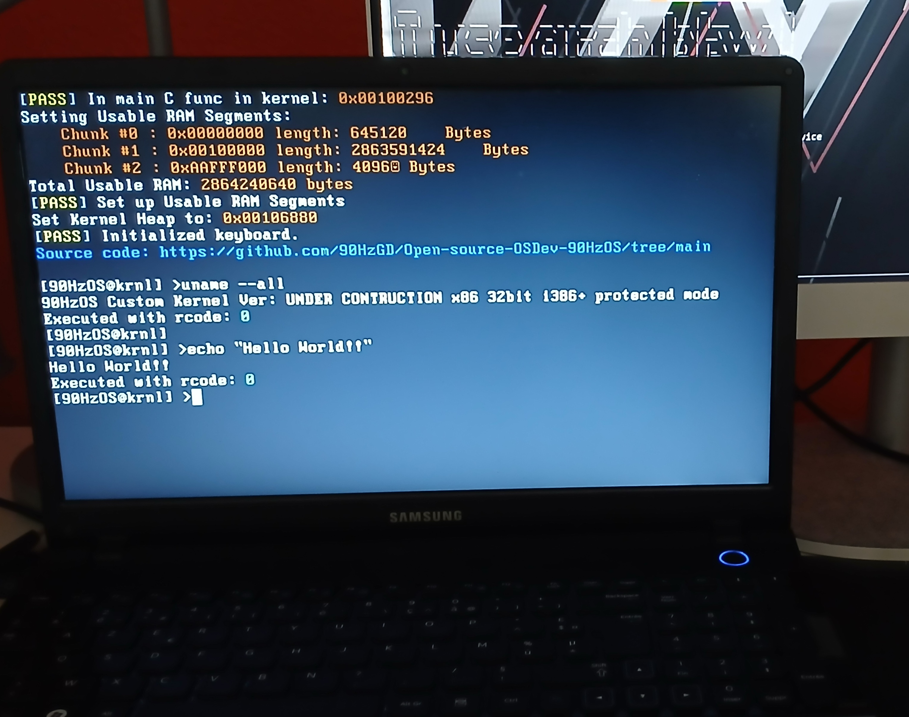
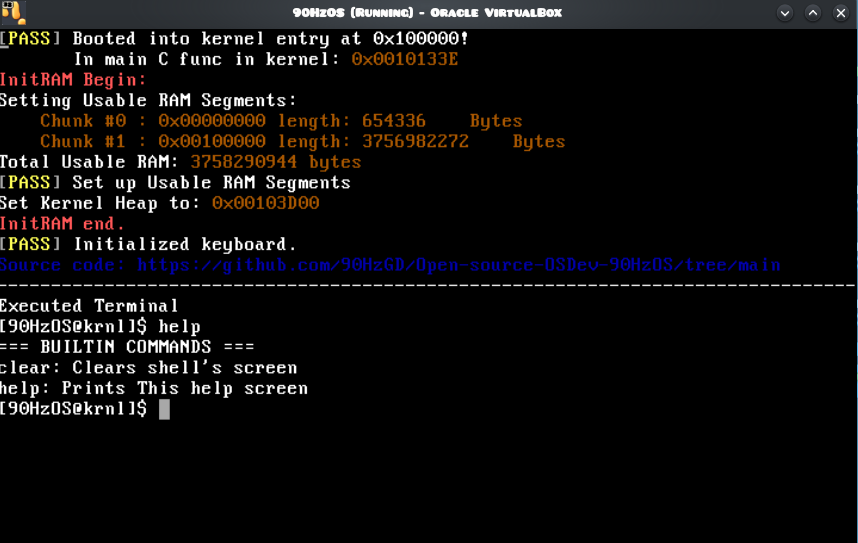
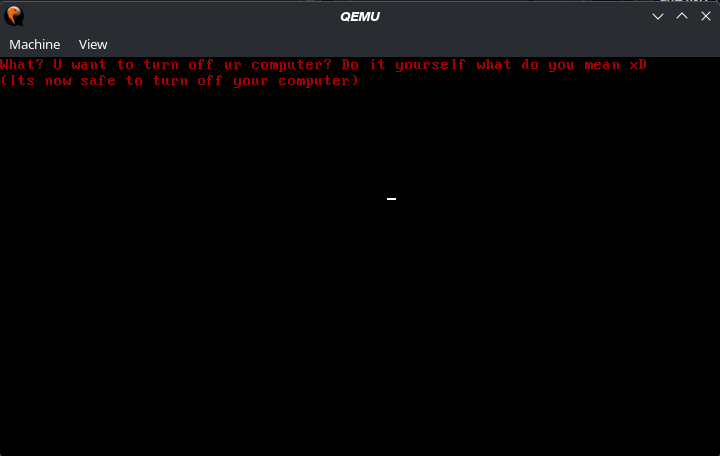

## Open Source OSDev Project made by a random French guy
90HzOS will be a future x86 i386+ operating system based on my Custom kernel in this repo.
This is the beginning of my project _90HzOS_. (Sorry for bad english) 
It even runs on REAL COMPUTER
This project **IS NOT PROFESSIONAL**

## GO TO
**Click Where you want to go!**
- [Here](#go-to)
    - [Project Progression](#project-progression)
    - [OS Screenshots](#os-screenshots)
    - [OS Features](#features)
        - [VGA Features](#vga-features)
        - [String Features](#string-features)
        - [Keyboard Features](#ps2-keyboard-features)
            - [Driver Features](#kb-driver)
            - [Keyboard API](#keyboard-driver-api)
        - [Memory Features](#memory-features)
        - [Other](#other-functions)
    - [What does the compiled OS?](#what-does-the-compiled-os)
    - [Compiling Tutorial (May need adaptations in Makefile)](#how-to-compile)
    - [How to run on QEMU](#how-to-run-on-qemu)
    - [How to run on VirtualBox](#how-to-run-on-virtualbox)
 
## Project Progression:
- **DONE:**
    - `[x] Valid Boot sector`
    - `[x] Custom OS loader: stage1 & stage2`
    - `[x] Global Descriptor Table`
    - `[x] Switch to Protected mode (32bit)`
    - `[x] Kernel Load`
    - `[x] Kernel Jump (main func())`
    - `[x] VGA Text lib (printf()...)`
    - `[x] E820 RAM Detection`
    - `[x] PS/2 Keyboard Driver`
    - `[x] PS/2 Keyboard API`
    - `[x] Memory Allocation Lib`
    - `[x] Shell execution`
    - `[x] Shell command parser`
    - `[x] Shell command executor`
    - `[x] Runs on 3 emulators: QEMU;86Box;VirtualBox`
    - `[x] Runs on real hardware!`
- **Planned:**
    - `[ ] Read / Write ATA Driver`
    - `[ ] Custom Filesystem`
    - `[ ] VESA BIOS Graphics mode (+custom font)`
    - `[ ] Custom image format`
    - `[ ] Read / Write AHCI Driver`

## OS Pictures
- 
    - 90HzOS while running on **real hardware** _(PC ref: Samsung NP300E5A-S04FR)_
- 
    - 90HzOS while running
- 
    - 90HzOS while shut down via ^Q(Ctrl + Q)

## FEATURES
- This OS features, for now, only really basic **Features**:
    - ## **VGA FEATURES**:
        - The OS is working in **VGA TEXT MODE** 80*25 grid (for now), so here are **VGA TEXT MODE** function in my OS:
            - **print_string():**      prints a string with a given color and position to the screen thanks to the printchar() func
            - **print_char():**        prints a char to the screen with a given color and position
            - **clear_screen():**      clears the screen
            - **setBG():**             changes screen's background color with a given color
            - **change_color():**      changes the color of the background of a given single position (& given color)
            - **move_grid():**         moves the **VGA TEXT MODE** grid.
            - **And the longest one: printf() which is divided in other functions:**
                - **printf():**             prints integers, unsigned integers, pointers, chars and strings inside of a given string with the sign: '%' in it, thanks to other functions
                - **print_integer():**      prints an integer to screen
                - **print_uinteger():**     prints an unsigned int to the screen
                - **print_hex():**          prints a hexadecimal RAM address
    - ## **STRING FEATURES**:
        - Some basic **strings functions**:
            - **reverse_string():**     reverses the bytes position in string _(if input = {'a', 'b', 'c'}, then output = {'c', 'b', 'a'}_.
            - **replace_string():**     copies the content of a given input to another, outputs in a given 2nd input
            - **length():**             outputs the length of a given string
            - **compare_string():**     outputs 1 if all elements of two given strings are the same, otherwise: outputs 0
            - **in_str_arr()**:         input: char** arr, char* str; output: 1 if str found in arr; 0 if not.
            - **search_str_arr():**     input: char** arr, char* str; output: -1 if str not found in str; if found: index in arr.
    - ## **PS2 KEYBOARD FEATURES**
        - ## **KB DRIVER**
            - Some Low level keyboard driver functions:
                - **init_idt():**             initializes the **Interrupt Descriptor table** _(idt)_ and calls load_idt()
                - **load_idt():**             loads the idt with lidt instruction
                - **kbinit():**               outbyte at 0x21: 0b11111101 (activates only keyboard)
                - **enable_int():**           enables CPU interrupts (only keyboard for now)
                - **keyboard_handler():**     set in idt, manages each input on the keyboard (such as pressed / released, toggles Shift on or off, same for Ctrl and Alt btw)
                - **handle_keyboard():**      in kernel.c, manages the output of the keyboard, if 0x64 returns 1, the kernel talks to 0x60 to get the scancode, manages extended keys too.
        - ## **KEYBOARD DRIVER API**
            - Some functions to easily access to the keyboard activity via this **API**:
                - **get_key():**           returns the latest keyboard scancode without blocking. _(Returns 0 if no key event is available.)_
                - **init_keys():**         initializes the API array's
                - **transkey():**          converts a raw scancode into a keyboard event structure containing the key state, modifier states, character representation, and release state.
                - **Shitkey():**           Used by transkey, returns the input as shifted on the keyboard _(examples: q -> Q; 1 -> !...)_ _(Shift ON/OFF formula: Shift Pressed XOR CapsLock)_
                - **extended_char():**     Also used by transkey, returns input if the key toggled is extended
  - ## **MEMORY FEATURES**
      - **Basic Memory allocation functions():**
          - **init_heap():**               Initializes the heap when booting
          - **malloc():**                  Allocates RAM with a given size in _bytes_ to a data, gives it an assigned block in the **HEAP**
          - **free():**                    Marks block generated by _malloc()_ in **HEAP** as free, **adds the blocks** next to this block if there are _unused_
          - **write_string():**            Writes a _string_ into a block data in the **HEAP**
          - **get_remain_heap_RAM():**     _(mode=0)_: Outputs remaining RAM after **last block in HEAP** | _(mode=1)_ Outputs remaining available size in the **HEAP** _(counts unused block)_
          - **get_previous_bloc():**       Util used by free(), Outputs the data pointer of the previous block in the **HEAP** _(with a block data pointer as input)_
          - **get_next_bloc():**           Util used by free(), Outputs the block data pointer of the block next, to the _given block data pointer_ as input
          - **init_bloc():**               Overrides the content of a given block data pointer, full of zeros
          - **alloc_str():**               Allocates strings in **heap**: input: char* str; output: 0 if error; allocation adr if not.
          - **free_str():**                Free all strings in a _char**_ array in the heap.
    - ## **OTHER FUNCTIONS**:
        - **init_RAM():** describes in a struct, where the OS can write to RAM in several segments, associated with the length for each segment _(kernel.c func btw)_

- ## **BOOT PROCESS**:
    - 1. The bootloader is loaded at `0x7C00`.
    - 2. It loads stage 2 from LBA 2048 to `0x5500`.
    - 3. Stage 2 retrieves the available RAM regions using BIOS E820.
    - 4. The kernel entry is loaded from LBA 2050 to `0x10000`.
    - 5. The GDT is loaded and the CPU switches to 32-bit protected mode.
    - 6. The kernel is moved from `0x10000` to `0x100000`.
    - 7. Execution jumps to the kernel entry point at `0x100000`.
    - 8. The kernel initializes memory and the keyboard.
    - 9. The shell starts.

## How To compile
**PLZ NOTE THAT SOME COMMANDS WONT WORK ON WINDOWS, SO I RECOMMEND USING A UNIX/GNULinux SYSTEM**
- 1. First you will need an emulator like qemu to run the 'OS' and an assembler:
- **On Arch Linux** (btw)
- Run these two commands below:
    - ``sudo pacman -Suy  # update packages & packages list``
    - ``sudo pacman -S nasm qemu-common``
- **On Ubuntu or any Debian based Linux Distro**
    - ``sudo apt update && sudo apt full-upgrade -y``
    - ``sudo apt install nasm qemu-common``
- **On Windows**
- Download the following files (you can also use curl with the link in PS):
  - ``https://www.nasm.us/pub/nasm/releasebuilds/3.02rc7/win64/nasm-3.02rc7-installer-x64.exe``
  - ``https://qemu.weilnetz.de/w64/2026/qemu-w64-setup-20260422.exe``

- 2. Then create an **OSDev** folder in your **HOME DIRECTORY**
- 3. Move all the content you downloaded from this repo into *~/OSDev*
- 4. Then you will need a cross-compiler and a linker:
    - Install gnu binutils:
         - ``mkdir /tmp/src``
         - ``cd /tmp/src``
         - ``curl -O https://ftp.gnu.org/gnu/binutils/binutils-with-gold-2.46.tar.xz``
         - ``tar xfv binutils-with-gold-2.46.tar.xz``
         - ``mkdir binutils-build``
         - ``cd binutils-build``
         - ``../binutils-with-gold-2.46/configure --target=i386-elf --enable-multilib --disable-nls --disable-werror --prefix=/usr/var/i386elfgcc 2>&1 | tee configure.log``
         - ``sudo make all install 2>&1 | tee make.log``
    - Install gcc cross compiler:
         - ``cd /tmp/src``
         - ``curl -O https://ftp.gnu.org/gnu/gcc/gcc-15.2.0/gcc-15.2.0.tar.xz``
         - ``tar xfv gcc-15.2.0.tar.xz``
         - ``mkdir gcc-build``
         - ``cd gcc-build``
         - ``../gcc-15.2.0/configure --target=i386-elf --prefix=/usr/var/i386elfgcc --disable-nls --disable-libssp --enable-language=c --without-headers``
         - ``sudo make all-gcc -j$(nproc)``
         - ``sudo make all-target-libgcc -j$(nproc)``
         - ``sudo make install-gcc -j$(nproc)``
         - ``sudo make install-target-libgcc -j$(nproc)``
- 5. Add cross compilers to the **PATH**:
    - On **UNIX/GNULinux**:
        - **TEMP**:
            - To add the compilers to the PATH **temporarily** *(disappear after closing bash session)*:
                - ``export PATH="/usr/var/i386elfgcc:$PATH"``
            - To add it **permanently**, you can edit your ~/.bashrc file:
                - ``nano ~/.bashrc``
                - Add this line at the end if file:
                    - ``export PATH="/usr/var/i386elfgcc:$PATH"``
    - On **Windows NT**:
        - Search for: *Edit environment variables*
        - Click on _edit environment variables_
        - Click on **PATH**
        - Then click  _edit_
        - Then add the PATH to your cross compilers directory at the end
        - Then apply changes and _reboot your computer_
- 6. **END**
    - If you did the previous steps correctly (sorry if didn't work) you can do: ``cd ~/OSDev`` then execute: ``make compile``
    - If you are on Windows, try to adapt the code of the Makefile!
    
## HOW TO RUN ON QEMU
- **RUN THIS COMMAND**:
    - ``qemu-system-x86_64 -monitor stdio -hda ~/OSDev/90HzOS/OS/90HzOS.bin``
## HOW TO RUN ON VIRTUALBOX:
- **HARD DRIVE**
    - Create a new virtual machine, convert the raw image to a Virtualbox hard drive image, and set it as the IDE of the VM
## HOW TO RUN ON 86Box:
- Set up a new virtual machine until setting up a hard drive, just click on **add existing** then **browse** and add the raw image at: _90HzOS/OS/90HzOS.bin_
## HOW TO RUN ON REAL HARDWARE (NO UEFI SUPPORT!!):
- First, recompile the Operating system by doing `make compile` in _~/OSDev_.
- Connect a bootable medium to your computer.
- Get device by doing `lsblk` in your terminal _(for example: /dev/sdb)_
- execute ./bash/writedisk.sh and type the device name then enter **DO NOT TYPE DEVICE WHERE YOUR RUNNING OPERATING SYSTEM IS!!**
- On Legacy boot BIOS computer boot on that medium
     
     
     
     
     
   
